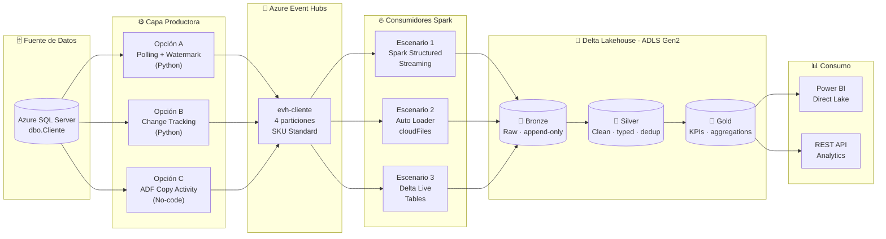
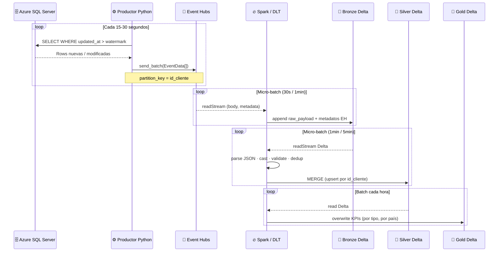
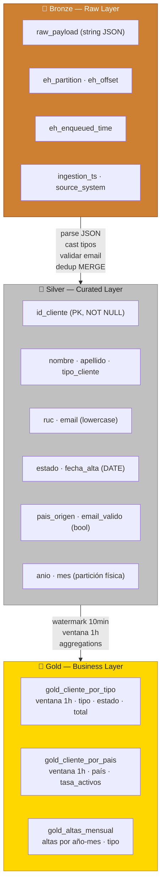
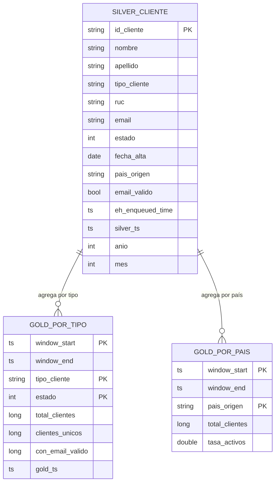
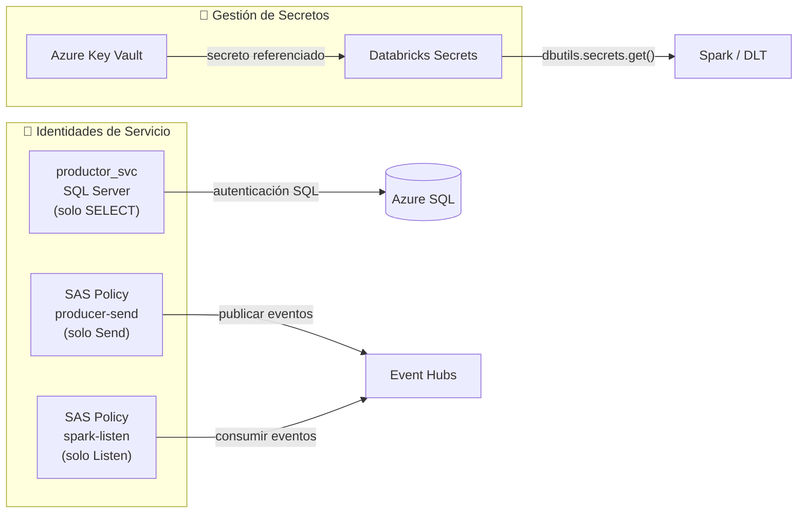

# 1-StreamingDemoE2EProject_V1
<div align="center">

# 🌊 Azure Event Hubs · Streaming Medallion Architecture

**End-to-end real-time data pipeline: Azure SQL Server → Event Hubs → Delta Lake**

[](https://azure.microsoft.com/en-us/products/event-hubs)
[](https://www.databricks.com)
[](https://www.python.org)
[](https://spark.apache.org)
[](LICENSE)

</div>

---

## 📖 Overview

Este proyecto implementa una arquitectura de ingesta de datos en **tiempo real** usando servicios nativos de Azure y Databricks. Los registros de clientes generados en **Azure SQL Server** son capturados, publicados en **Azure Event Hubs**, y procesados hacia un **Data Lakehouse** con arquitectura medallion (Bronze → Silver → Gold) usando tres estrategias de consumo.

> **Caso de uso:** Sincronización en tiempo real de una tabla de clientes OLTP hacia una capa analítica con calidad de datos, deduplicación y KPIs de negocio.

---

## 🏗️ Arquitectura General



---

## 🔄 Flujo de Datos Detallado



---

## 📁 Estructura del Repositorio

```
📦 azure-eventhubs-medallion/
│
├── 📂 docs/
│   └── EventHubs_Medallion_Streaming_Guide.docx   # Guía técnica completa
│
├── 📂 producer/                    # Capa productora (SQL Server → Event Hubs)
│   ├── producer_polling.py         # Opción A: Polling con watermark
│   ├── producer_change_tracking.py # Opción B: Change Tracking (CT)
│   ├── verify_events.py            # Script de verificación del hub
│   ├── .env.example                # Plantilla de variables de entorno
│   └── requirements.txt
│
├── 📂 sql/                         # Scripts DDL para Azure SQL Server
│   ├── 01_create_table_cliente.sql # Tabla dbo.Cliente + índice + trigger
│   ├── 02_enable_change_tracking.sql
│   └── 03_seed_data.sql            # Datos de prueba
│
├── 📂 scenario_1_structured_streaming/    # Escenario 1
│   ├── 00_config.py
│   ├── 01_bronze_streaming.py
│   ├── 02_silver_streaming.py
│   └── 03_gold_streaming.py
│
├── 📂 scenario_2_autoloader/              # Escenario 2
│   ├── 00_config.py
│   ├── 01_al_bronze_streaming.py
│   ├── 02_al_silver_merge.py
│   └── 03_al_gold_batch.py
│
├── 📂 scenario_3_dlt/                     # Escenario 3
│   └── pipeline_cliente_medallion.py      # Pipeline DLT completo (3 capas)
│
├── 📂 adf/                                # Opción C: Azure Data Factory
│   ├── linkedService_AzureSQL.json
│   ├── linkedService_EventHubs.json
│   └── pipeline_SQLtoEventHubs.json
│
├── 📂 infra/                              # Infraestructura como código
│   └── deploy.sh                          # Script de creación de recursos Azure CLI
│
├── .gitignore
└── README.md
```

---

## ⚡ Comparativa de Escenarios

| Criterio | 🔵 Escenario 1<br>Structured Streaming | 🟣 Escenario 2<br>Auto Loader | 🟢 Escenario 3<br>Delta Live Tables |
|---|:---:|:---:|:---:|
| **Latencia** | < 30 seg | 5-10 min | < 30 seg (Continuous) |
| **Origen directo** | Event Hubs | Archivos ADLS (Capture) | Event Hubs |
| **Deduplicación** | Manual (foreachBatch) | Manual (MERGE) | Automática |
| **Calidad de datos** | Manual (filter/when) | Manual | Declarativa (`@expect`) |
| **Linaje automático** | ❌ | ❌ | ✅ Unity Catalog |
| **Reintentos auto** | ❌ Job retry | ❌ Job retry | ✅ |
| **Plataforma** | Databricks + Fabric | Databricks + Fabric | Solo Databricks |
| **Complejidad setup** | 🟡 Media | 🔴 Alta | 🟢 Baja |
| **Recomendado para** | POC / Fabric | Alto volumen de archivos | Producción Databricks |

---

## 🚀 Quick Start

### 1. Clonar el repositorio

```bash
git clone https://github.com/<tu-usuario>/azure-eventhubs-medallion.git
cd azure-eventhubs-medallion
```

### 2. Configurar variables de entorno

```bash
cp producer/.env.example producer/.env
# Editar producer/.env con tus credenciales
```

```ini
# producer/.env
SQL_SERVER=<tu-servidor>.database.windows.net
SQL_DATABASE=<tu-base-de-datos>
SQL_USER=productor_svc@<tu-servidor>
SQL_PASSWORD=<tu-password>
SQL_DRIVER={ODBC Driver 18 for SQL Server}

EH_CONNECTION_STRING=Endpoint=sb://<namespace>.servicebus.windows.net/;SharedAccessKeyName=producer-send;SharedAccessKey=<key>
EH_NAME=evh-cliente

POLL_INTERVAL_SECONDS=30
BATCH_SIZE=500
```

### 3. Preparar Azure SQL Server

```bash
# Ejecutar en SQL Server Management Studio o Azure Data Studio
sqlcmd -S <servidor>.database.windows.net -d <database> -U <user> -P <password> \
       -i sql/01_create_table_cliente.sql
sqlcmd -S <servidor>.database.windows.net -d <database> -U <user> -P <password> \
       -i sql/03_seed_data.sql
```

### 4. Instalar dependencias del productor

```bash
pip install -r producer/requirements.txt
```

### 5. Levantar el productor

```bash
# Opción A — Polling
python producer/producer_polling.py

# Opción B — Change Tracking (requiere CT habilitado en SQL)
python producer/producer_change_tracking.py
```

### 6. Verificar eventos en Event Hubs

```bash
python producer/verify_events.py
# Deberías ver JSON de clientes impresos en consola
```

### 7. Ejecutar el consumidor Spark (Databricks)

Importa los notebooks de la carpeta del escenario elegido en tu workspace de Databricks y ejecútalos en orden (00 → 01 → 02 → 03).

---

## 🛠️ Infraestructura Azure (CLI)

```bash
# Crear todos los recursos necesarios con Azure CLI
bash infra/deploy.sh

# O manualmente:
RESOURCE_GROUP="rg-streaming-poc"
LOCATION="eastus2"
NAMESPACE="evhns-streaming-poc"

az group create --name $RESOURCE_GROUP --location $LOCATION

az eventhubs namespace create \
  --name $NAMESPACE \
  --resource-group $RESOURCE_GROUP \
  --sku Standard \
  --enable-auto-inflate true \
  --maximum-throughput-units 10

az eventhubs eventhub create \
  --name evh-cliente \
  --namespace-name $NAMESPACE \
  --resource-group $RESOURCE_GROUP \
  --partition-count 4 \
  --message-retention 1

az eventhubs eventhub consumer-group create \
  --name cg-spark-structured \
  --eventhub-name evh-cliente \
  --namespace-name $NAMESPACE \
  --resource-group $RESOURCE_GROUP

az eventhubs eventhub consumer-group create \
  --name cg-dlt \
  --eventhub-name evh-cliente \
  --namespace-name $NAMESPACE \
  --resource-group $RESOURCE_GROUP
```

---

## 🏅 Arquitectura Medallion



---

## 📐 Modelo de Datos — Tabla Silver



---

## 🔐 Seguridad



> ⚠️ **Nunca** commitees credenciales al repositorio. Usa siempre `.env` (ignorado por `.gitignore`) o Databricks Secrets en producción.

---

## 📦 Dependencias

### Productor Python

```
azure-eventhub>=5.11.0
pyodbc>=4.0.39
python-dotenv>=1.0.0
azure-identity>=1.15.0
```

### Clúster Databricks (Maven)

```
com.microsoft.azure:azure-eventhubs-spark_2.12:2.3.22
```

### Runtime Databricks recomendado

| Escenario | Runtime mínimo |
|---|---|
| Structured Streaming | DBR 11.3 LTS (Spark 3.3) |
| Auto Loader | DBR 10.4 LTS (Spark 3.2) |
| Delta Live Tables | DBR 12.2 LTS+ |

---

## 📚 Documentación Adicional

- 📄 [`docs/EventHubs_Medallion_Streaming_Guide.docx`](docs/EventHubs_Medallion_Streaming_Guide.docx) — Guía técnica completa con todos los pasos de configuración
- [Azure Event Hubs Documentation](https://learn.microsoft.com/azure/event-hubs/)
- [Databricks Auto Loader](https://docs.databricks.com/ingestion/auto-loader/index.html)
- [Delta Live Tables](https://docs.databricks.com/delta-live-tables/index.html)
- [Azure SQL Change Tracking](https://learn.microsoft.com/sql/relational-databases/track-changes/about-change-tracking-sql-server)

---

## 🗺️ Roadmap

- [x] Productor Python con Polling (Opción A)
- [x] Productor Python con Change Tracking (Opción B)
- [x] ADF Pipeline como productor (Opción C)
- [x] Escenario 1: Spark Structured Streaming
- [x] Escenario 2: Auto Loader + MERGE upsert
- [x] Escenario 3: Delta Live Tables con expectativas
- [ ] Terraform para infraestructura completa
- [ ] CI/CD con GitHub Actions para deploy de notebooks
- [ ] Monitoreo con Azure Monitor + alertas
- [ ] Soporte para Microsoft Fabric (Lakehouse + Eventstream)

---

## 🤝 Contribuciones

Las contribuciones son bienvenidas. Por favor abre un issue o pull request para:
- Correcciones de código o documentación
- Nuevos escenarios de consumo
- Soporte para otros orígenes de datos (Oracle, PostgreSQL, SAP)

---

## 📝 Licencia

MIT © 2025 — Distribuido con fines educativos y de referencia técnica.

---

<div align="center">

**Construido con ❤️ usando Azure Event Hubs · Apache Spark · Delta Lake**

</div>
