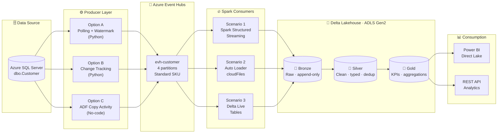
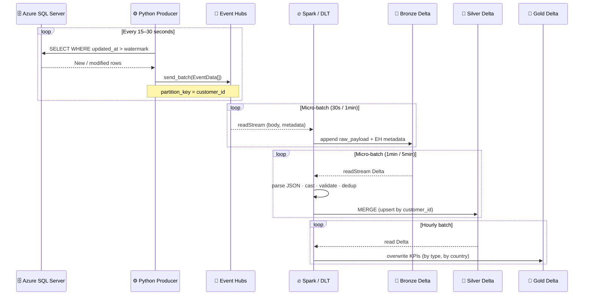
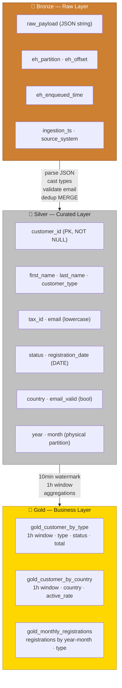
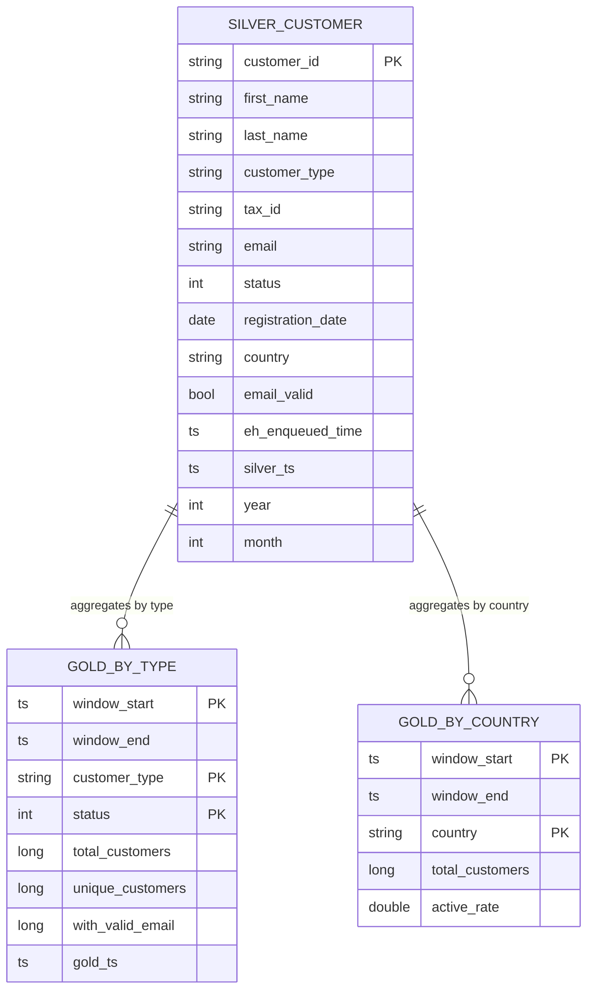
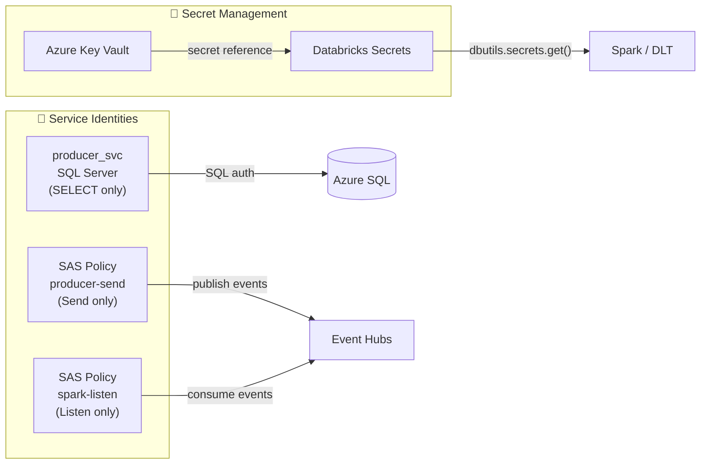

<div align="center">

# 🌊 Azure Event Hubs · Streaming Medallion Architecture

**End-to-end real-time data pipeline: Azure SQL Server → Event Hubs → Delta Lake**

[](https://azure.microsoft.com/en-us/products/event-hubs)
[](https://www.databricks.com)
[](https://www.python.org)
[](https://spark.apache.org)
[](LICENSE)

</div>

---

## 📖 Overview

This project implements a **real-time data ingestion** architecture using native Azure and Databricks services. Customer records generated in **Azure SQL Server** are captured, published to **Azure Event Hubs**, and processed into a **Delta Lakehouse** following the medallion architecture (Bronze → Silver → Gold) using three different consumption strategies.

> **Use case:** Real-time synchronization of an OLTP customer table into an analytical layer with data quality rules, deduplication, and business KPIs.

---

## 🏗️ General Architecture



---

## 🔄 Detailed Data Flow



---

## 📁 Repository Structure

```
📦 azure-eventhubs-medallion/
│
├── 📂 docs/
│   └── EventHubs_Medallion_Streaming_Guide.docx   # Full technical guide
│
├── 📂 producer/                      # Producer layer (SQL Server → Event Hubs)
│   ├── producer_polling.py           # Option A: Watermark-based polling
│   ├── producer_change_tracking.py   # Option B: Change Tracking (CT)
│   ├── verify_events.py              # Hub verification script
│   ├── .env.example                  # Environment variables template
│   └── requirements.txt
│
├── 📂 sql/                           # DDL scripts for Azure SQL Server
│   ├── 01_create_table_customer.sql  # dbo.Customer table + index + trigger
│   ├── 02_enable_change_tracking.sql
│   └── 03_seed_data.sql              # Sample data
│
├── 📂 scenario_1_structured_streaming/    # Scenario 1
│   ├── 00_config.py
│   ├── 01_bronze_streaming.py
│   ├── 02_silver_streaming.py
│   └── 03_gold_streaming.py
│
├── 📂 scenario_2_autoloader/              # Scenario 2
│   ├── 00_config.py
│   ├── 01_al_bronze_streaming.py
│   ├── 02_al_silver_merge.py
│   └── 03_al_gold_batch.py
│
├── 📂 scenario_3_dlt/                     # Scenario 3
│   └── pipeline_customer_medallion.py     # Full DLT pipeline (3 layers)
│
├── 📂 adf/                                # Option C: Azure Data Factory
│   ├── linkedService_AzureSQL.json
│   ├── linkedService_EventHubs.json
│   └── pipeline_SQLtoEventHubs.json
│
├── 📂 infra/                              # Infrastructure as code
│   └── deploy.sh                          # Azure CLI resource creation script
│
├── .gitignore
└── README.md
```

---

## ⚡ Scenario Comparison

| Criteria | 🔵 Scenario 1<br>Structured Streaming | 🟣 Scenario 2<br>Auto Loader | 🟢 Scenario 3<br>Delta Live Tables |
|---|:---:|:---:|:---:|
| **Latency** | < 30 sec | 5–10 min | < 30 sec (Continuous) |
| **Direct source** | Event Hubs | ADLS files (Capture) | Event Hubs |
| **Deduplication** | Manual (foreachBatch) | Manual (MERGE) | Automatic |
| **Data quality** | Manual (filter/when) | Manual | Declarative (`@expect`) |
| **Automatic lineage** | ❌ | ❌ | ✅ Unity Catalog |
| **Auto-retry** | ❌ Job retry | ❌ Job retry | ✅ |
| **Platform** | Databricks + Fabric | Databricks + Fabric | Databricks only |
| **Setup complexity** | 🟡 Medium | 🔴 High | 🟢 Low |
| **Best for** | POC / Fabric | High file volume | Databricks production |

---

## 🚀 Quick Start

### 1. Clone the repository

```bash
git clone https://github.com/<your-username>/azure-eventhubs-medallion.git
cd azure-eventhubs-medallion
```

### 2. Set up environment variables

```bash
cp producer/.env.example producer/.env
# Edit producer/.env with your credentials
```

```ini
# producer/.env
SQL_SERVER=<your-server>.database.windows.net
SQL_DATABASE=<your-database>
SQL_USER=producer_svc@<your-server>
SQL_PASSWORD=<your-password>
SQL_DRIVER={ODBC Driver 18 for SQL Server}

EH_CONNECTION_STRING=Endpoint=sb://<namespace>.servicebus.windows.net/;SharedAccessKeyName=producer-send;SharedAccessKey=<key>
EH_NAME=evh-customer

POLL_INTERVAL_SECONDS=30
BATCH_SIZE=500
```

### 3. Prepare Azure SQL Server

```bash
sqlcmd -S <server>.database.windows.net -d <database> -U <user> -P <password> \
       -i sql/01_create_table_customer.sql
sqlcmd -S <server>.database.windows.net -d <database> -U <user> -P <password> \
       -i sql/03_seed_data.sql
```

### 4. Install producer dependencies

```bash
pip install -r producer/requirements.txt
```

### 5. Start the producer

```bash
# Option A — Polling
python producer/producer_polling.py

# Option B — Change Tracking (requires CT enabled in SQL)
python producer/producer_change_tracking.py
```

### 6. Verify events in Event Hubs

```bash
python producer/verify_events.py
# You should see customer JSON printed to the console
```

### 7. Run the Spark consumer (Databricks)

Import the notebooks from your chosen scenario folder into your Databricks workspace and run them in order (00 → 01 → 02 → 03).

---

## 🛠️ Azure Infrastructure (CLI)

```bash
# Create all required resources with Azure CLI
bash infra/deploy.sh

# Or manually:
RESOURCE_GROUP="rg-streaming-poc"
LOCATION="eastus2"
NAMESPACE="evhns-streaming-poc"

az group create --name $RESOURCE_GROUP --location $LOCATION

az eventhubs namespace create \
  --name $NAMESPACE \
  --resource-group $RESOURCE_GROUP \
  --sku Standard \
  --enable-auto-inflate true \
  --maximum-throughput-units 10

az eventhubs eventhub create \
  --name evh-customer \
  --namespace-name $NAMESPACE \
  --resource-group $RESOURCE_GROUP \
  --partition-count 4 \
  --message-retention 1

az eventhubs eventhub consumer-group create \
  --name cg-spark-structured \
  --eventhub-name evh-customer \
  --namespace-name $NAMESPACE \
  --resource-group $RESOURCE_GROUP

az eventhubs eventhub consumer-group create \
  --name cg-dlt \
  --eventhub-name evh-customer \
  --namespace-name $NAMESPACE \
  --resource-group $RESOURCE_GROUP
```

---

## 🏅 Medallion Architecture



---

## 📐 Data Model — Silver Table



---

## 🔐 Security



> ⚠️ **Never** commit credentials to the repository. Always use `.env` (ignored by `.gitignore`) or Databricks Secrets in production environments.

---

## 📦 Dependencies

### Python Producer

```
azure-eventhub>=5.11.0
pyodbc>=4.0.39
python-dotenv>=1.0.0
azure-identity>=1.15.0
```

### Databricks Cluster (Maven)

```
com.microsoft.azure:azure-eventhubs-spark_2.12:2.3.22
```

### Recommended Databricks Runtime

| Scenario | Minimum Runtime |
|---|---|
| Structured Streaming | DBR 11.3 LTS (Spark 3.3) |
| Auto Loader | DBR 10.4 LTS (Spark 3.2) |
| Delta Live Tables | DBR 12.2 LTS+ |

---

## 📚 Additional Documentation

- 📄 [`docs/EventHubs_Medallion_Streaming_Guide.docx`](docs/EventHubs_Medallion_Streaming_Guide.docx) — Full technical guide with all configuration steps
- [Azure Event Hubs Documentation](https://learn.microsoft.com/azure/event-hubs/)
- [Databricks Auto Loader](https://docs.databricks.com/ingestion/auto-loader/index.html)
- [Delta Live Tables](https://docs.databricks.com/delta-live-tables/index.html)
- [SQL Server Change Tracking](https://learn.microsoft.com/sql/relational-databases/track-changes/about-change-tracking-sql-server)

---

## 🗺️ Roadmap

- [x] Python producer with Polling (Option A)
- [x] Python producer with Change Tracking (Option B)
- [x] ADF Pipeline as producer (Option C)
- [x] Scenario 1: Spark Structured Streaming
- [x] Scenario 2: Auto Loader + MERGE upsert
- [x] Scenario 3: Delta Live Tables with expectations
- [ ] Terraform for full infrastructure
- [ ] CI/CD with GitHub Actions for notebook deployment
- [ ] Monitoring with Azure Monitor + alerts
- [ ] Microsoft Fabric support (Lakehouse + Eventstream)

---

## 🤝 Contributing

Contributions are welcome. Please open an issue or pull request for:
- Code or documentation fixes
- New consumption scenarios
- Support for additional data sources (Oracle, PostgreSQL, SAP)

---

## 📝 License

MIT © 2025 — Distributed for educational and technical reference purposes.

---

<div align="center">

**Built with ❤️ using Azure Event Hubs · Apache Spark · Delta Lake**

</div>
